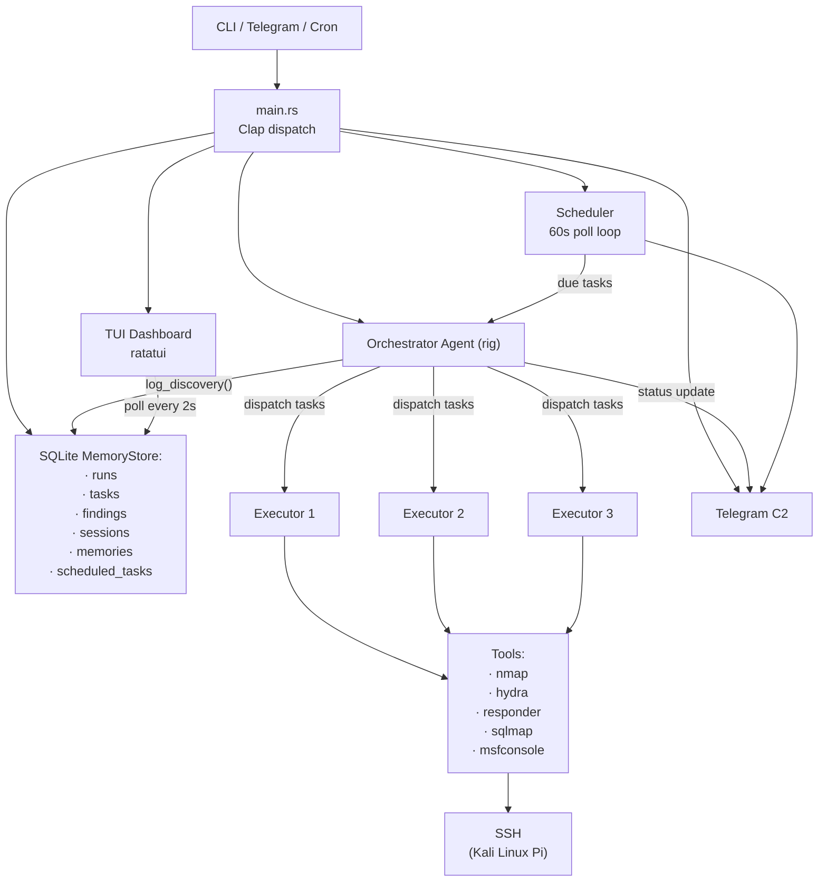

# Eugene

<p align="center">
  
</p>

**Autonomous offensive security agent** powered by [rig-core](https://github.com/0xPlaygrounds/rig). Drop it on a Raspberry Pi running Kali and let it loose. It uses whatever offensive tools are installed (nmap, hydra, sqlmap, msfconsole, etc.), writes scripts when the job calls for it, and decides what to do next on its own. Runs, findings, and scores are tracked in SQLite. Control it from Telegram or a TUI dashboard.

> **Sanctioned use only.** Designed for authorised network environments. Shell injection and Pi-destructive commands are blocked. Everything else is in scope.

---

## Features

| | |
|---|---|
| **Planner/Executor architecture** | Orchestrator breaks work into parallel tasks; specialist executor agents run each one independently via tokio + semaphore-bounded concurrency |
| **Persistent SQLite memory** | Runs, tasks, findings, sessions, memories, and scheduled tasks — all local, no cloud. FTS5 full-text search with salience decay |
| **Telegram C2** | Trigger runs, chat with the agent, query findings, and manage schedules from your phone |
| **Session resumption** | Every Telegram chat maps to a persisted conversation thread; the agent picks up exactly where it left off |
| **Task scheduler** | Create recurring autonomous missions with cron expressions; results pushed to Telegram |
| **TUI dashboard** | Full-screen ratatui dashboard with progress gauge, findings table, activity log, and real-time DB polling |
| **Safety layer** | Shell metachar injection prevention + hard block on filesystem/shutdown commands — all offensive tools unrestricted |
| **Systemd service** | One command generates a `systemd` user service for always-on operation on Raspberry Pi |

---

## Architecture



---

## Installation

**Requirements:** Rust 2024 edition, [cargo](https://rustup.rs/).

```bash
git clone <your-repo-url> eugene
cd eugene
cargo build --release
cp .env.example .env
$EDITOR .env  # add MINIMAX_API_KEY at minimum
```

### ARM cross-compilation (Raspberry Pi)

```bash
# Using cross (recommended on macOS)
cargo install cross
cross build --target=aarch64-unknown-linux-gnu --release

# Deploy to Pi over Tailscale
scp target/aarch64-unknown-linux-gnu/release/eugene kali@100.99.249.70:/home/kali/
```

### Always-on service (Raspberry Pi)

```bash
eugene service

systemctl --user daemon-reload
systemctl --user enable eugene
systemctl --user start eugene

sudo loginctl enable-linger $USER   # survive logout

journalctl --user -u eugene -f   # tail logs
```

---

## Quick Start

```bash
# One-shot recon run (launches TUI dashboard)
eugene run 10.0.0.0/24

# Custom target
eugene run 192.168.1.0/24

# Telegram C2 bot (includes scheduler)
eugene bot

# Create a recurring scheduled task
eugene schedule create --cron "0 9 * * *" "scan for new hosts on the network"

# List scheduled tasks
eugene schedule list
```

---

## Configuration

Key environment variables:

| Variable | Default | Description |
|----------|---------|-------------|
| `MINIMAX_API_KEY` | — | MiniMax API key **(required)** |
| `TELEGRAM_BOT_TOKEN` | — | Telegram bot token |
| `ALLOWED_CHAT_IDS` | — | Comma-separated allowed Telegram chat IDs |
| `EUGENE_DB_PATH` | `eugene.db` | SQLite database path |

### LLM Provider Compatibility

| Provider | Status | Notes |
|----------|--------|-------|
| MiniMax (M2.5) | Supported | Current default provider |
| Anthropic (Claude) | Coming soon | |
| OpenAI (GPT-4) | Coming soon | |
| Ollama (local) | Coming soon | |

---

## Telegram C2

| Command | Description |
|---------|-------------|
| `/start` | Show help and command list |
| `/run [instruction]` | Trigger a full recon campaign |
| `/status` | Show last run summary with findings count |
| `/findings [host]` | Query findings, optionally filtered by host |
| `/newchat` | Clear conversation history |
| `/schedule create <cron> <prompt>` | Create a recurring task |
| `/schedule list` / `pause` / `resume` / `delete` | Manage tasks |

Any non-command message is passed directly to the orchestrator as a natural-language instruction.

---

## CLI Reference

```
eugene <COMMAND>

Commands:
  run       Run a one-shot recon task (launches TUI dashboard)
  bot       Start the Telegram bot (includes scheduler)
  schedule  Manage scheduled tasks
  service   Generate systemd user service file

Schedule subcommands:
  create --cron <CRON> <PROMPT>   Create scheduled task with 5-field cron
  list                            List all scheduled tasks
  delete <ID>                     Delete task by UUID
  pause <ID>                      Pause a task
  resume <ID>                     Resume a paused task
```

---

## Project Structure

```
src/
├── main.rs           # Entry point, clap dispatch
├── cli.rs            # Subcommand definitions
├── config.rs         # Environment configuration
├── service.rs        # Systemd service generator
├── lib.rs            # Library exports
├── agent/            # LLM agent orchestration (rig-core)
├── bot/              # Telegram bot (teloxide + dptree)
├── executor/         # Command execution with timeout enforcement
├── memory/           # SQLite store with FTS5 and salience decay
├── orchestrator/     # Campaign orchestration and parallel dispatch
├── safety/           # Command validation (blocks destructive, allows offensive)
├── scheduler/        # Cron-based task scheduling (croner)
├── tools/            # Agent tool definitions (run_command, log_discovery, ...)
└── tui/              # Ratatui dashboard with real-time DB polling
```

---

## Development

```bash
cargo test              # Run all tests (~160)
cargo clippy -- -D warnings   # Lint
cargo fmt               # Format
```
