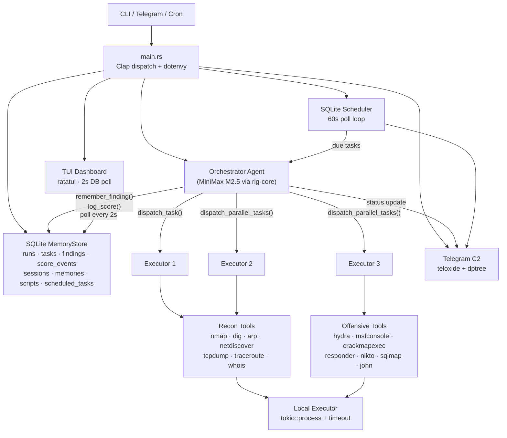
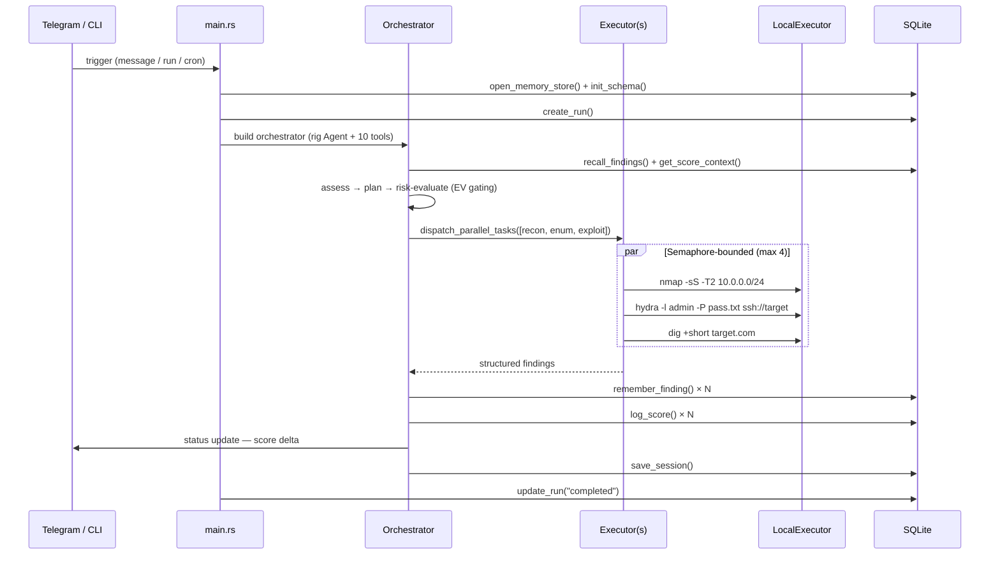

# Architecture

## System diagram



## Data flow



## Operational loop

Each trigger (cron / Telegram / CLI) runs the same five-phase loop:

```
ORIENT   → interface_info + arp_table to understand Pi's network position
DISCOVER → passive tcpdump → ARP sweep → ping sweep (nmap -sn)
ENUM     → SYN scan + service detection per discovered host
FINGERP  → OS detection + vulnerability scripts against promising services
EXPLOIT  → if EV > 0: targeted exploitation, verify result, claim points
LOG      → remember_finding() + log_score() for everything
REPORT   → status update to Telegram with score delta
IDLE     → wait for next trigger
```

## Project structure

```
src/
├── main.rs                    # Entry point — clap dispatch, dotenvy, tokio runtime
├── lib.rs                     # Library crate exports
├── cli.rs                     # Clap subcommand definitions
├── config.rs                  # Environment-based Config struct
├── service.rs                 # Systemd user service generator
│
├── agent/
│   ├── mod.rs                 # Agent builder + MiniMax client setup
│   ├── client.rs              # MiniMax M2.5 API client (via rig-core)
│   ├── prompt.rs              # System prompts — orchestrator, executor, single-agent
│   └── mock.rs                # MockCompletionModel for testing
│
├── bot/
│   ├── mod.rs                 # Telegram bot entry — teloxide + dptree dispatch
│   ├── commands.rs            # /start /run /status /findings /newchat /schedule
│   ├── handlers.rs            # Free-text message handler (→ orchestrator)
│   ├── session.rs             # Per-chat session persistence
│   └── formatting.rs          # HTML message formatting
│
├── executor/
│   ├── mod.rs
│   └── local.rs               # tokio::process executor with timeout + safety
│
├── orchestrator/
│   ├── mod.rs
│   └── dispatch.rs            # DispatchTask + DispatchParallelTasks tools
│
├── safety/
│   ├── mod.rs                 # validate_command() + sanitize_target()
│   └── errors.rs              # SafetyError enum
│
├── scheduler/
│   ├── mod.rs                 # spawn_scheduler() background task
│   └── cron.rs                # Cron validation + next_occurrence (croner)
│
├── memory/
│   ├── mod.rs                 # open_memory_store() + init_schema()
│   ├── schema.sql             # 10-table schema with FTS5 + triggers
│   ├── queries.rs             # All CRUD operations
│   ├── decay.rs               # Salience decay (2%/day, prune < 0.1)
│   └── errors.rs              # MemoryError enum
│
├── tools/
│   ├── mod.rs                 # Tool registry — make_*_tools() factories
│   ├── run_command.rs         # Execute CLI commands via LocalExecutor
│   ├── log_discovery.rs       # Persist findings to SQLite
│   ├── remember.rs            # Cross-phase finding persistence
│   ├── recall.rs              # Retrieve findings by host
│   ├── run_summary.rs         # Run statistics
│   ├── log_score.rs           # Score event logging with fixed point values
│   ├── get_score_context.rs   # Current score + detection count for EV calc
│   ├── save_script.rs         # Persist reusable scripts to DB
│   ├── search_scripts.rs      # FTS5 script search
│   ├── run_script.rs          # Execute saved scripts via interpreter
│   └── errors.rs              # ToolError enum
│
└── tui/
    ├── mod.rs                 # TUI main loop — ratatui + crossterm
    ├── events.rs              # Keyboard + tick event handling
    └── widgets.rs             # Progress gauge, findings table, activity log

tests/
├── agent.rs                   # Agent orchestration tests
├── memory.rs                  # Database + FTS5 tests
├── tools.rs                   # Tool integration tests
├── live.rs                    # Live environment tests (feature-gated)
└── common/
    └── mod.rs                 # Shared test utilities
```
