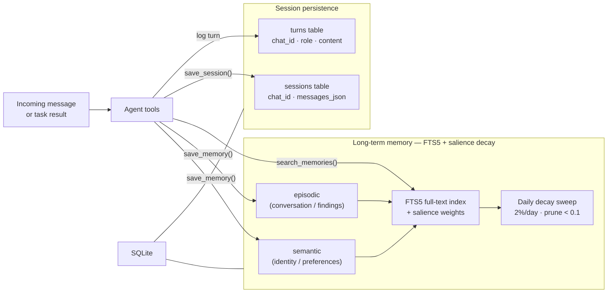

# Memory System

## Memory types

**Memories** — Long-term storage with FTS5 full-text search and salience decay. Each memory has:
- `chat_id`: Scoped to a Telegram chat or CLI session
- `sector`: `semantic` (identity/preference statements) or `episodic` (regular conversation)
- `salience`: Starts at 1.0, decays 2% daily for memories older than 1 day
- Full-text searchable via `memories_fts` virtual table

**Sessions** — Per-chat message history stored as JSON. The agent loads the full conversation on each message so it picks up exactly where it left off. `/newchat` clears it.

**Turns** — Simple chronological log of user/assistant turns per chat. Used for context window management.

## Salience decay

A background tokio task runs every 24 hours:

1. **Decay**: `salience *= 0.98` for all memories older than 1 day
2. **Prune**: Delete memories where `salience < 0.1`

This means a memory with no reinforcement fades over ~230 days before being pruned. Frequently accessed memories have their `accessed_at` timestamp updated, which the orchestrator can use to prioritize recent findings.

## Agent memory tools

| Tool | Used by | Description |
|------|---------|-------------|
| `remember_finding` | Orchestrator | Persist a finding (host, type, data) for cross-phase recall |
| `recall_findings` | Orchestrator | Retrieve all findings for a specific host |
| `get_run_summary` | Orchestrator | Get counts of findings and tasks for the current run |
| `log_discovery` | Executor | Persist structured finding from task execution |
| `save_script` | Both | Save a reusable bash/python script to the database |
| `search_scripts` | Both | FTS5 search across script names, descriptions, tags |
| `run_script` | Both | Execute a saved script by name via interpreter |
