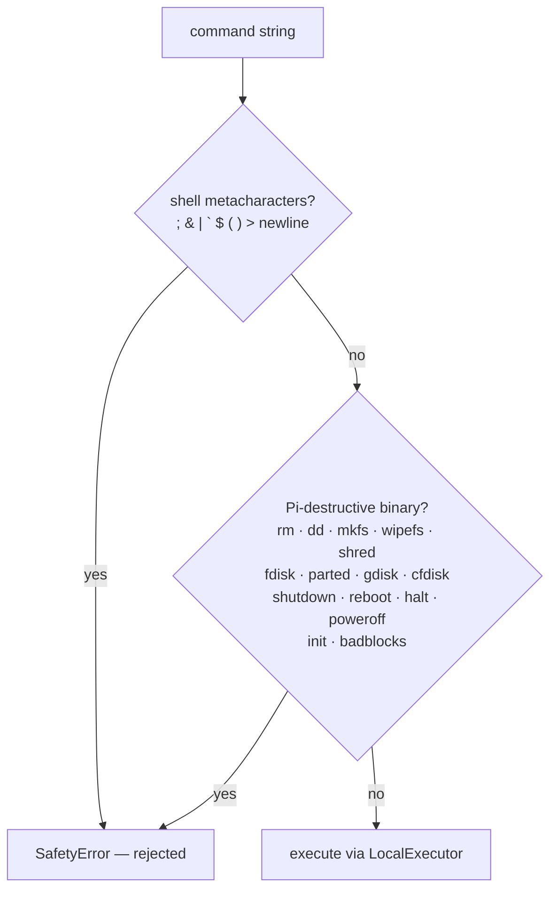
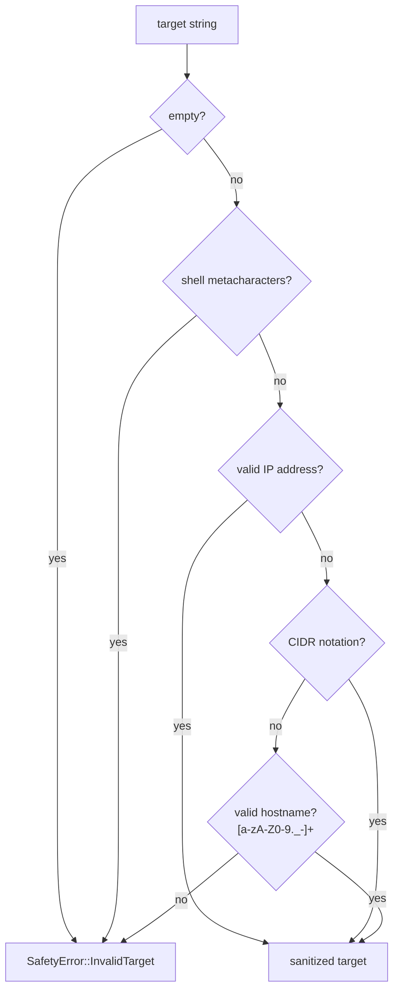

# Safety Layer

Protects the Pi from self-destruction. All offensive security tools are unrestricted.

## Target validation

The `sanitize_target()` function validates targets before use:

## Permitted

**All offensive security tools are permitted** — nmap (all flags and script categories), hydra, metasploit, nikto, gobuster, crackmapexec, john, responder, sqlmap, impacket-*, bettercap, dig, tcpdump, traceroute, whois, netdiscover, arp.

## Blocked (Pi protection only)

**Filesystem destruction:** `rm`, `dd`, `mkfs`, `mkfs.ext4`, `mkfs.vfat`, `mkfs.ntfs`, `wipefs`, `shred`

**Partition manipulation:** `fdisk`, `parted`, `gdisk`, `cfdisk`

**System shutdown:** `shutdown`, `reboot`, `halt`, `poweroff`, `init`

**Secure erase:** `badblocks`

Shell metacharacters (``; & | ` $ ( ) > \n``) are always rejected to prevent command injection chaining. The `sudo` prefix is stripped before binary checking, so `sudo rm` is also blocked.
