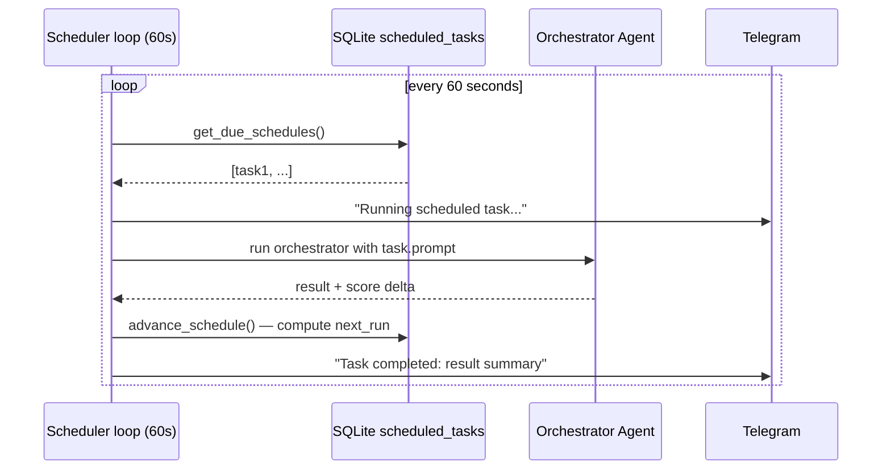

# Scheduler

SQLite-polled every 60 seconds. Create autonomous missions that run on a cron schedule and report results via Telegram.



## CLI usage

```bash
# Schedule a recon sweep every 6 hours
eugene schedule create --cron "0 */6 * * *" "Full recon sweep — maximise score"

# Nightly credential capture
eugene schedule create --cron "0 2 * * *" \
  "Run responder passively, attempt hydra on discovered SSH hosts"

# List all schedules (tabular output)
eugene schedule list

# Manage schedules
eugene schedule pause <uuid>
eugene schedule resume <uuid>
eugene schedule delete <uuid>
```

`schedule list` prints a formatted table with columns: ID, Cron, Status, Prompt.

## Telegram commands

| Command | Description |
|---------|-------------|
| `/schedule create <cron> <prompt>` | Create a recurring autonomous task |
| `/schedule list` | List your scheduled tasks |
| `/schedule delete <id>` | Delete a task |
| `/schedule pause <id>` | Pause a task |
| `/schedule resume <id>` | Resume a task |

## Cron expressions

Standard 5-field cron format parsed by [croner](https://docs.rs/croner): `min hour day month weekday`

| Expression | Meaning |
|------------|---------|
| `* * * * *` | Every minute |
| `0 */6 * * *` | Every 6 hours |
| `0 2 * * *` | Daily at 02:00 |
| `0 9 * * 1-5` | Weekdays at 09:00 |
| `0 0 1 * *` | First of each month |

The scheduler spawns automatically when `eugene bot` starts. It runs as a background tokio task alongside the Telegram dispatcher.
