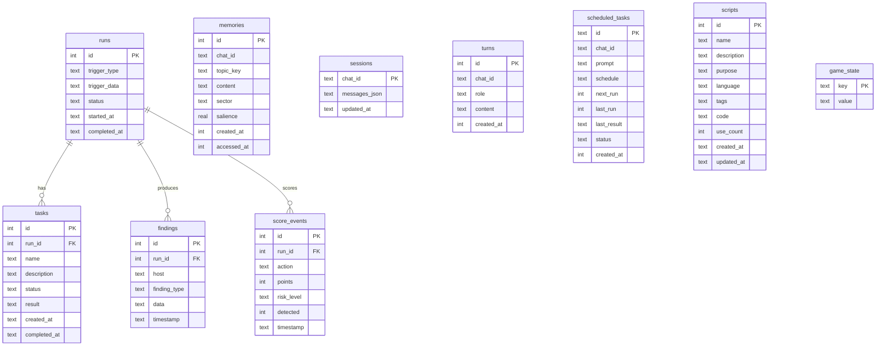

# SQLite Schema

10-table schema with FTS5 full-text search, WAL mode, and foreign keys. Defined in `src/memory/schema.sql`.

## FTS5 virtual tables

Two FTS5 indexes with automatic sync via triggers:

- **`memories_fts`** — full-text search over `memories.content`. Used by `search_memories()` / the `recall` tool.
- **`scripts_fts`** — full-text search over `scripts.name`, `scripts.description`, `scripts.tags`. Used by `search_scripts()`.

Insert/update/delete triggers keep FTS5 tables in sync with their source tables automatically.

## Pragmas

Applied at connection time in `open_memory_store()`:

| Pragma | Value | Purpose |
|--------|-------|---------|
| `journal_mode` | WAL | Better read/write concurrency |
| `synchronous` | NORMAL | Faster than FULL, safe with WAL |
| `mmap_size` | 8388608 | 8MB memory-mapped I/O |
| `temp_store` | MEMORY | Temp tables in RAM |
| `foreign_keys` | ON | Enforce FK constraints |
