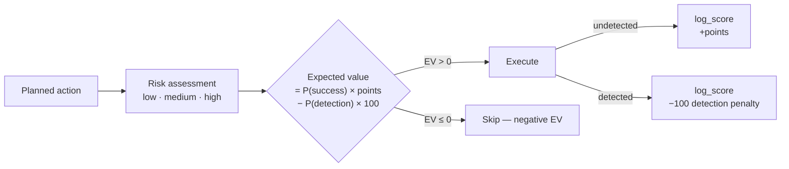

# Scoring System

The agent operates as a CTF-style scoring game. Every action is assessed for risk before execution via Expected Value (EV) calculation, and results are logged to `score_events` in SQLite.



## Points table

| Discovery / Action | Base Points | Risk Level |
|--------------------|-------------|------------|
| Live host confirmed | +10 | low |
| Open port identified | +5 | low |
| Service + version fingerprinted | +15 | low |
| OS fingerprint confirmed | +20 | low |
| Vulnerability detected | +25 | low |
| Credentials captured | +50 | medium |
| Successful login | +75 | medium |
| Privilege escalation verified | +150 | high |
| Remote code execution verified | +200 | high |
| Sensitive data accessed | +100 | high |
| **Detected by IDS/IPS/firewall** | **-100** | — |

## EV risk gating

Before any exploitation action, the orchestrator calculates:

```
EV = (reward_points × P(success)) − (100 × P(detection))
```

Probabilities are estimated from:
- Service version confidence and known vulnerability reliability
- Network security posture (IDS indicators, firewall rules observed)
- Stealth techniques available (timing, fragmentation, encryption)
- Historical detection rate from `get_score_context`

Only proceed if EV > 0.

## Score-aware strategy

| Condition | Strategy |
|-----------|----------|
| Total score < 100 | Prioritize high-value targets and quick wins |
| Total score > 300 | Focus on thoroughness and exploitation |
| Detection count > 2 | Switch to passive/stealthy techniques |

The orchestrator calls `get_score_context` before planning each phase to inform these decisions.

## Detection triggers

Anything that produces logs, alerts, or anomalies: aggressive scans at `-T4`/`-T5`, failed login attempts above threshold, traffic spikes, noisy exploit attempts, connection resets, or blocked IPs.

When detected, the agent logs a detection event immediately, adjusts strategy (lower-profile techniques or different target), and recalculates EV for remaining actions.

## Score tools

| Tool | Description |
|------|-------------|
| `log_score` | Log a score event with action name and risk level. Points are looked up from the fixed table. |
| `get_score_context` | Returns total score, detection count, and recent events for EV calculations. |
